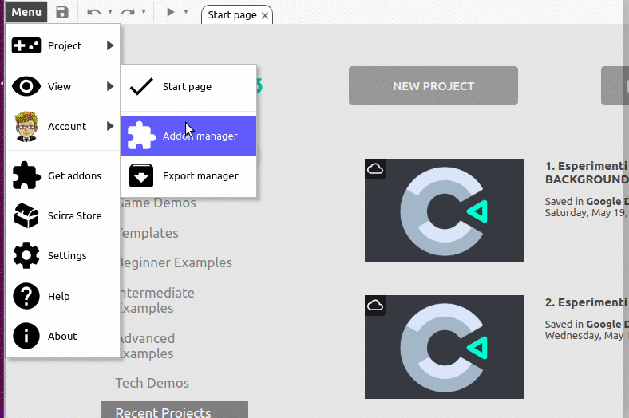
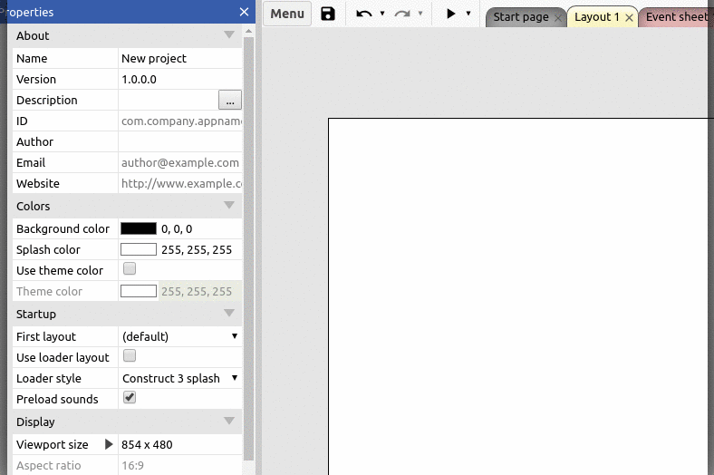

# BUBBLY BACKGROUND

`Beautiful bubbly backgrounds for Construct 3 project`

Download:
- [C3Addon](download/current/bubbly-background.c3addon)
- [Demo C3P](download/demo/style-background.c3p)

This plugin allows to change the predifined background with a fancy bubbly one. It's useful to avoid the black bars when the app doesn't fit the screen.

The original idea is by [@tipsy](https://github.com/tipsy) and his [bubbly-bg repository](https://github.com/tipsy/bubbly-bg).

 * Link to the [online demo](https://c3plugins.stranianelli.com/bubbly-background/demo/style-background/).
 * Link to [Construct 3 Addon Exchange](https://www.construct.net/en/make-games/addons/130/bubbly-background)

### How to install

### How add it to a project

### ACTIONS

**Main**
* `Reset Property`: Reset proterty to default value.
* `Redraw Background`: Redraw background.

**Set Property**
* `Change style to {0}`: Change background style to
    - Solid
    - Gradient
    - Bubbly
* `Change preset bubbly to {0}`: Change preset bubbly style to:
    - Custom
    - Blue with white bubbles
    - Black/red with red bubbles
    - Purple with multicolored bubbles
    - Yellow/pink with red/orange/yellow bubbles
* `Background animation set to {0}`:
* `Compose set to {0}`: Choose how to compose the bubbles:
    - Lighter
    - Source Over
* `Blur set to {0}`: Set the blur (a number value).
* `Bubbles set to {0}`: Insert a number or a function to set the number of bubbles to show.
* `Bubble Func set to {0}`: Insert a function to set the bubbles's color.
    - e.g.: `() => hsla(0, 0%, 100%, ${r() * 0.1})`
* `Angle Func set to {0}`: Insert a function or a number to set the bubbles's angle.
    - e.g.: `() => Math.random() * Math.PI * 2`
* `Velocity Func set to {0}`: Insert a function or a number to set the bubbles's velocity.
    - e.g.: `() => 0.1 + Math.random() * 0.5`
* `Radius Func set to {0}`: Insert a function or a number to set the bubbles's radius.
    - e.g.: `() => 4 + Math.random() * canvas.width / 25`
* `Color Start set to {0}`: The background gradient start color.
    - e.g.: `#22aaee`
    - e.g.: `red`
    - e.g.: `rgb(255,0,0)`
    - e.g.: `rgba(255,0,0,0.5)`
* `Color Stop set to {0}`: The background gradient stop color.
    - e.g.: `#22aaee`
    - e.g.: `red`
    - e.g.: `rgb(255,0,0)`
    - e.g.: `rgba(255,0,0,0.5)`
* `Shadow Color set to {0}`: The bubbles's shadow color.
    - e.g.: `#22aaee`
    - e.g.: `red`
    - e.g.: `rgb(255,0,0)`
    - e.g.: `rgba(255,0,0,0.5)`

### EXPRESSONS

* `getStyleBackground`
* `getPresetBubbly`
* `getBlur`
* `isAnimate`
* `getCompose`
* `getBubbles`
* `getBubbleFunc`
* `getAngleFunc`
* `getVelocityFunc`
* `getRadiusFunc`
* `getColorStart`
* `getColorStop`
* `getColorShadow`

### CONDITIONS

* `The background is animate`: Test if the background is animated.
* `The compose is lighter`: Test if compose is set to Lighter or to Source Over.

### JSON

* `Load background from JSON`: Load the background settings from a string in JSON format. This can be retrieved from either the getAsStringJSON expression.
* `getAsStringJSON`: Return the settings of the background as a string in JSON format. This can later be loaded in to the plugin with the Load action. The string is C2-C3 style:
  - "{""name"":""John Doe""}"
* `getAsJSON`: Return the setting as as a string in JSON format. The string is standard style:
  - { "name": "John Doe" }

### DEMO GIF

### Other info

Icon made by [Freepik](http://www.freepik.com) from [Flaticon](https://www.flaticon.com).

Apps for Linux and Windows made with [ElectronJS](https://electronjs.org/).
