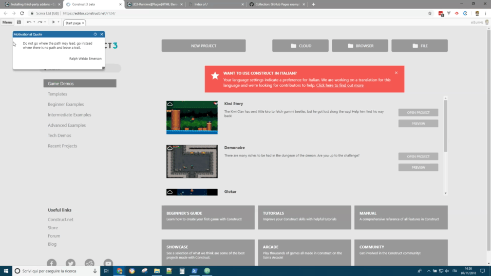
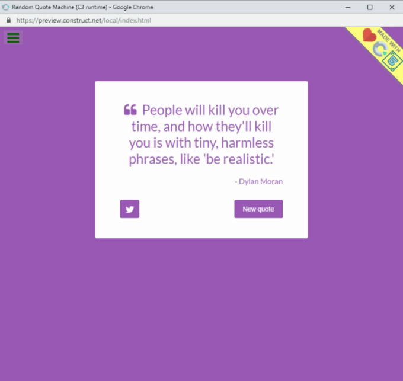

# HTML ELEMENT

`The power of the HTML5 inside Construct3. Create HTMLElements, handle events and manage CSS style.`

### Download

- [C3Addon](download/current/html-element.c3addon)
- Demo:
  - [markdown-previewer](download/demo/markdown-previewer.c3p)
  - [personal-portfolio](download/demo/personal-portfolio.c3p)
  - [product-landing-page](download/demo/product-landing-page.c3p)
  - [random-quote-machine](download/demo/random-quote-machine.c3p)
  - [survey-form](download/demo/survey-form.c3p)
  - [survey-form-with-pinch-to-zoom](download/demo/survey-form-with-pinch-to-zoom.c3p)
  - [technical-documentation-page](download/demo/technical-documentation-page.c3p)
  - [tribute-page](download/demo/tribute-page.c3p)
  - [store](download/demo/store.c3p)
  - [inline-event-handlers](download/demo/inline-event-handlers.c3p)
  - [workaround-2020-02-16](download/demo/workaround-2020-02-16.c3p)

### Link

- Link to [c3addon](https://www.construct.net/en/make-games/addons/190/html-element)
- Demo:
  - [markdown-previewer](https://c3plugins.stranianelli.com/html-element/demo/markdown-previewer/)
  - [personal-portfolio](https://c3plugins.stranianelli.com/html-element/demo/personal-portfolio/)
  - [product-landing-page](https://c3plugins.stranianelli.com/html-element/demo/product-landing-page/)
  - [random-quote-machine](https://c3plugins.stranianelli.com/html-element/demo/random-quote-machine/)
  - [survey-form](https://c3plugins.stranianelli.com/html-element/demo/survey-form/)
  - [survey-form-with-pinch-to-zoom](https://c3plugins.stranianelli.com/html-element/demo/survey-form-with-pinch-to-zoom/)
  - [technical-documentation-page](https://c3plugins.stranianelli.com/html-element/demo/technical-documentation-page/)
  - [tribute-page](https://c3plugins.stranianelli.com/html-element/demo/tribute-page/)
- [Forum](https://www.construct.net/en/forum/construct-3/plugin-sdk-10/c3-runtime-plugin-html-element-138689)

### Short Description

The idea is to have an intuitive mode to add HTML Elements to a Construct 3 Project. With this plugin you can easily add and manipulate the DOM, change CSS styles, IDs and Classes, and even add listeners to an element.

### How to install

See the C3's guide: [INSTALLING THIRD-PARTY ADDONS](https://www.construct.net/en/make-games/manuals/construct-3/tips-and-guides/installing-third-party-addons)

### What you can do

With **HTML Element for Construct 3** you can add e manipulate the dom element easily. You can use the standard _Event Sheet View_ (in C3) or custom js to create web application.

For example, you can pass the [FreeCodeCamp Certifications](https://learn.freecodecamp.org/) (Web Design Certification and Front End Libraries Certification).

**Portfolio**

* [Link to online version](https://c3plugins.stranianelli.com/html-element/demo/personal-portfolio/)
* [Link to project file (C3P)](download/demo/personal-portfolio.c3p)

**Markdown Editor and Previewer**

* [Link to online version](https://c3plugins.stranianelli.com/html-element/demo/markdown-previewer/)
* [Link to project file (C3P)](download/demo/markdown-previewer.c3p)

**Random Quote Machine**

* [Link to online version](https://c3plugins.stranianelli.com/html-element/demo/random-quote-machine/)
* [Link to project file (C3P)](download/demo/random-quote-machine.c3p)

**Landing Page**

* [Link to online version](https://c3plugins.stranianelli.com/html-element/demo/product-landing-page/)
* [Link to project file (C3P)](download/demo/product-landing-page.c3p)

**Survey Form**

* [Link to online version](https://c3plugins.stranianelli.com/html-element/demo/survey-form-with-pinch-to-zoom/)
* [Link to project file (C3P)](download/demo/survey-form-with-pinch-to-zoom.c3p)

**Technical documentation**

* [Link to online version](https://c3plugins.stranianelli.com/html-element/demo/technical-documentation-page/)
* [Link to project file (C3P)](download/demo/technical-documentation-page.c3p)

**Tribute Page**

* [Link to online version](https://c3plugins.stranianelli.com/html-element/demo/tribute-page/)
* [Link to project file (C3P)](download/demo/tribute-page.c3p)
