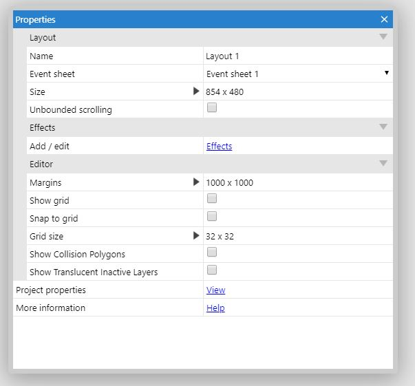
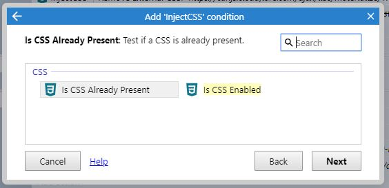
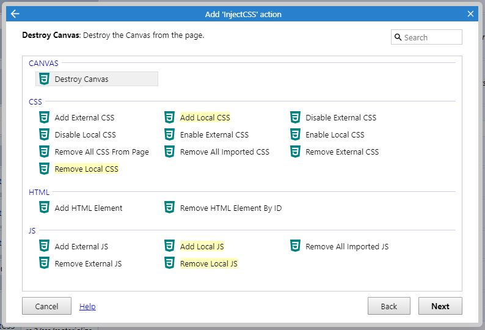
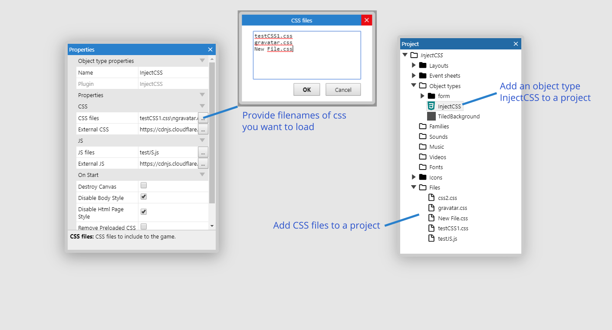
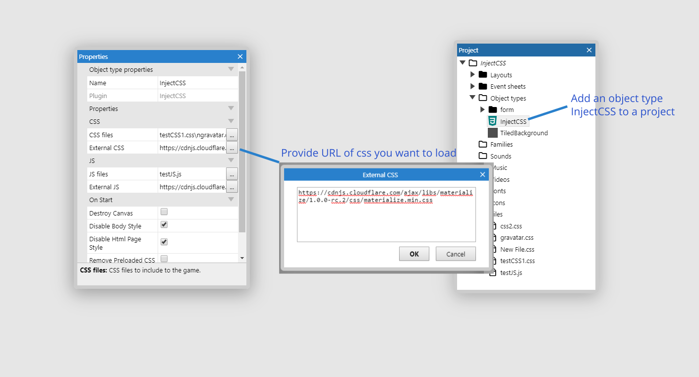

# INJECT CSS

`Use CSS stylesheet in Construct 3 and inject simple html elements. (ONLY C3 RUNTIME)`

## OLD VERSION

- [GO TO THE NEW VERSION](https://c3plugins.stranianelli.com/css/)
- [github](https://github.com/el3um4s/construct-plugins-and-addons/tree/master/css)

### Download

- [C3Addon](download/current/inject-css.c3addon)
- Demo:
  - [inject-css](download/demo/inject-css.c3p)
  - [youtube](download/demo/youtube.c3p)
  - [iframe](download/demo/iframe.c3p)
  - [showdownjs](download/demo/showdownjs.c3p)
  - [inception](download/demo/inception.c3p)
  - [change-input](download/demo/change-input.c3p)

### Link

- Link to [c3addon](https://www.construct.net/en/make-games/addons/166/inject-css)
- Demo:
  - [inject-css](https://c3plugins.stranianelli.com/inject-css/demo/inject-css/)
  - [youtube](https://c3plugins.stranianelli.com/inject-css/demo/youtube/)
  - [iframe](https://c3plugins.stranianelli.com/inject-css/demo/iframe/)
  - [showdownjs](https://c3plugins.stranianelli.com/inject-css/demo/showdownjs/)
  - [inception](https://c3plugins.stranianelli.com/inject-css/demo/inception/)
  - [change-input](https://c3plugins.stranianelli.com/inject-css/demo/change-input/)

### Short Description

Use CSS stylesheet in Construct 3 and inject simple html elements.

### ACEs

#### CSS

- **Add Local CSS: {0}** [_action_] Add a local CSS file.
- **Add External CSS: {0}** [_action_] Add an External CSS file.
- **Remove Local CSS: {0}** [_action_] Remove a Local CSS file.
- **Remove External CSS: {0}** [_action_] Remove an External CSS file.
- **Remove All Imported CSS** [_action_] Remove all imported CSS file.
- **Remove ALL CSS From Page** [_action_] Remove all CSS file.
- **Disable Local CSS: {0}** [_action_] Disable a Local CSS file.
- **Disable External CSS: {0}** [_action_] Disable an External CSS file.
- **Enable Local CSS: {0}** [_action_] Enable a Local CSS file.
- **Enable External CSS: {0}** [_action_] Enable an External CSS file.
- **{0} is already present** [_condition_] Test if a CSS is already present.
- **{0} is enabled** [_condition_] Test if a CSS is enabled.

#### JS

- **Add Local JS: {0}** [_action_] Add a local JS file.
- **Add External JS: {0}** [_action_] Add an External JS file.
- **Remove Local JS: {0}** [_action_] Remove a Local JS file.
- **Remove External JS: {0}** [_action_] Remove an External JS file.
- **Remove All Imported JS** [_action_] Remove all imported JS file.

#### CANVAS

- **Destroy Canvas** [_action_] Destroy the Canvas from the page.

#### HTML

- **Add HTML Element: {0}** [_action_] Add HTML Element.
- **Remove HTML Element By ID: {0}** [_action_] Remove HTML Element By ID.

#### Properties

#### Conditions

#### Actions

### How to insert local CSS file

### How to insert remote CSS

