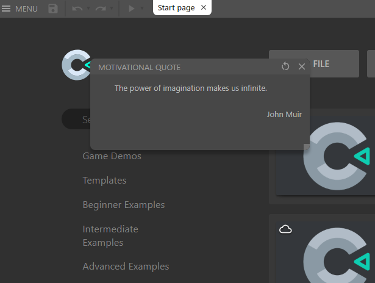
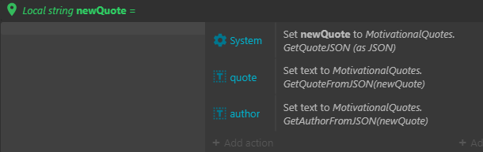

# MOTIVATIONAL QUOTES

`Get and create motivational quotes`

### Download

- [C3Addon](download/current/motivational-quotes.c3addon)
- Demo:
  - [motivational-quotes](download/demo/motivational-quotes.c3p)

### Link
- Link to [c3addon](https://www.construct.net/en/make-games/addons/175/motivational-quotes)
- Demo:
  - [motivational-quotes](https://c3plugins.stranianelli.com/motivational-quotes/demo/motivational-quotes/)

###  Short Description
This plugin has **two parts**:

1. the first shows a motivation quote when you launch Construct 3.
1. the second provide a random motivational quote in your personal project

It's possible to set **3 sources** for the random quotes:
1. the plugin's library
1. a project file in your own project
1. a json file from another site

In the example file I show how to use all the 3 methods. The external source is set on [FreeCodeCamp](https://github.com/freeCodeCamp/freeCodeCamp/blob/staging/common/app/utils/words.json) repository but you can customize it.

### ACEs

#### DEFAULT

-  **GetQuoteJSON**: [_expression_] Get a quote like a JSON ({quote, author}).
-  **GetQuoteFromJSON**: [_expression_] Get the quote from a JSON string ({quote, author}).
-  **GetAuthorFromJSON**: [_expression_] Get the author from a JSON string ({quote, author}).

#### LOCAL
- **Initialize JSON from file {0}**: [_action_] Inizialize a JSON from a project file.
- **GetQuoteFromLocalJSON**: [_expression_] Get a quote like a JSON ({quote, author}) from a project file.
- **GetPropertyFromJSON**: [_expression_] Get a property from a JSON file.

#### OTHERS
- **Inizialize an external JSON from URL {1} with alias {0}**: [_action_] Initialize a JSON from an external URL.
- **GetQuoteFromExternalJSON**: [_expression_] Get a quote like a JSON ({quote, author}) from a remote file.
- **GetPropertyFromJSON**: [_expression_] Get a property from a JSON file.

#### REMOVE
- **Remove JSON {0} from the memory**: [_action_] Remove a JSON from the memory.
- **Remove all the JSONs from the memory**: [_action_] Remove all the JSONs from the memory.

### Show a motivation quote

### How to use

`  -> System: Set newQuote to MotivationalQuotes.GetQuoteJSON (as JSON)`

`  -> quote: Set text to MotivationalQuotes.GetQuoteFromJSON(newQuote)`

`  -> author: Set text to MotivationalQuotes.GetAuthorFromJSON(newQuote)`
